# Minimum Viable Product (MVP):

1. Створимо додаток за допомогою графічного інтерфейсу. 
- Натискаємо `+ NEW APP` 
- Вводимо ім'я додатку `demo`
- Проект до якого належить додаток оберемо `за замовчуванням`
- Тип синхронізації оберемо `Manual`
- Ставимо галку напроти `AUTO-CREATE NAMESPACE`
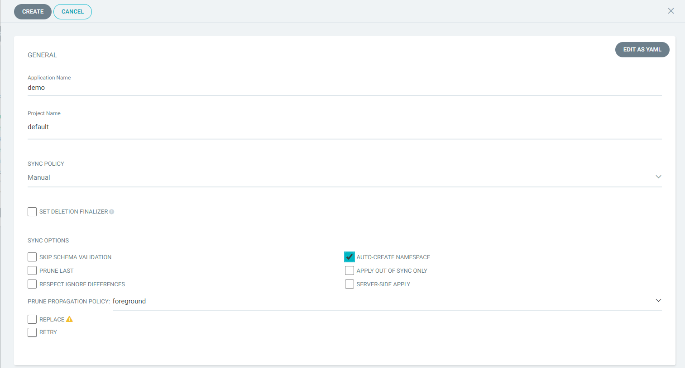  
- У розділі `SOURCE` тип джерела залишаємо за замовчуванням `GIT`
- Введемо `url` репозиторію, який містить маніфести для розгортання https://github.com/nicksya/go-demo-app
- У полі `Path` введемо шлях до каталогу `helm`  
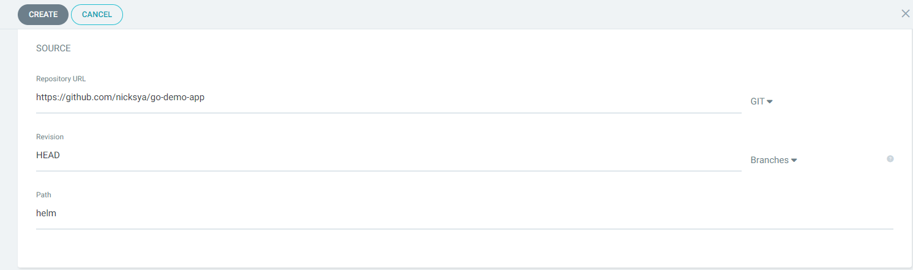  
- В розділі `DESTINATION` вибираємо `url` локального кластеру та `Namespace` вказуэмо `demo` після чого ArgoCD автоматично визначить параметри додатку використавши маніфести, які знаходяться в репозиторії.  
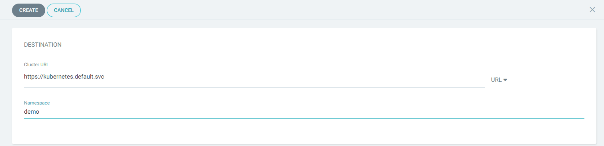  
 
- Створюємо додаток кнопкою `CREATE`  
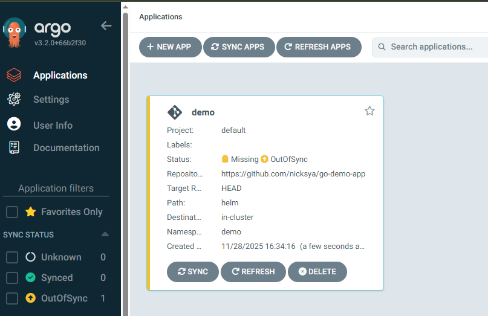

2. Так як додаток створено із вимкненою політикою синхронізаціі то необхідно вручну запустити цей процесс щоб ArgoCD перейшов до створення ресурсів. 
- Для цього у вікні відомостей про програму натискаємо кнопку `SYNC` 
- У панелі праворуч потрібно можна змінити набір компонентів та режими синхронізації і натиснути `SYNCHRONIZE`
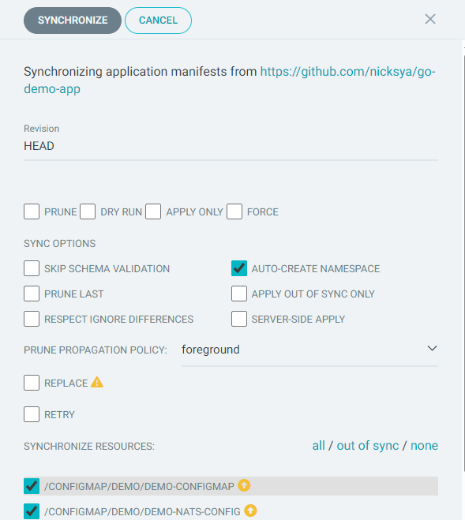  
- Після завершення процесу можемо перевірити правильність розгортання програми, перевіривши їх статус у кластері. 

3. Переглянемо деталі розгорнутого застосунку натиснувши на нього в списку.  
Графічний інтерфейс надає ієрархічне уявлення про компоненти програми, їх розгортання та поточний стан. 

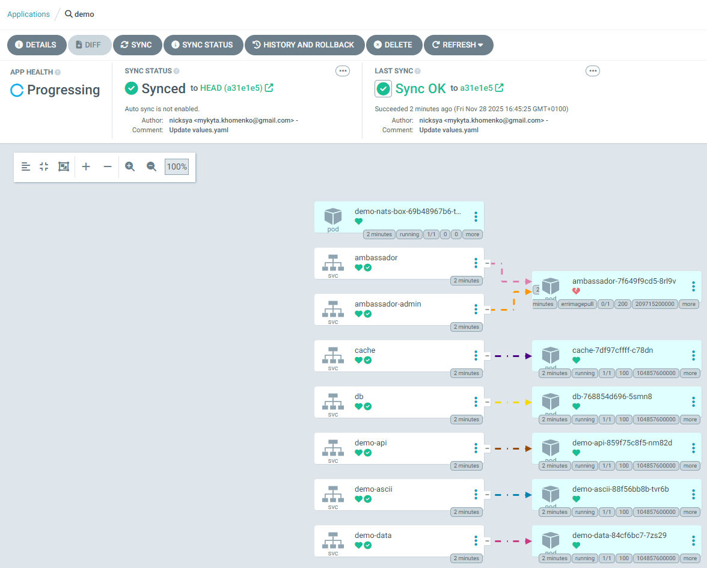 

4. Одразу помітно те, що стан здоров'я додатку `ambassador` невизначено, отже розбираємося


- Натискаємо три крапки та обираємо `Logs`
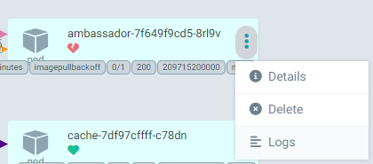

- Далі `Events`

Отже контейнер імедж компоненту `ambassador` має старий формат, що не пітримується наявним container runtime. Конвертувати імедж до нового формату можна за допомогою утиліти `skopeo`

```bash
skopeo copy --format v2s2 docker://quay.io/datawire/ambassador:0.51.2 docker://docker.io/mykytakhomenko/ambassador:0.51.2
```

Утиліта зберігає конвертований імедж у наш власний репозиторій, тому маємо оновити параметри додатку щоб ArgoCD викачав його та синхронізував сам додаток.

- В [репозиторії з конфігураційними файлами helm](https://github.com/nicksya/go-demo-app/blob/master/helm/values.yaml) додамо у розділ api-gateway.image параметр `repository: docker.io/mykytakhomenko` та робимо Commit

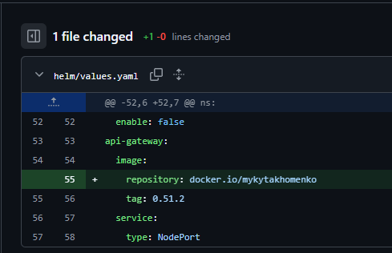

5. Так як додаток створено із режимом манульноі синхронізаціі то маємо знов синхронізувати або увімкнути автосинхронізацію. У цьому режимі ArgoCD автоматично визначатиме зміни у репозиторіі та одразу вноситиме іх у конфігурацію додатку.
- Відкриємо деталі додатку та поставимо галочку у `ENABLE AUTOSYNC`
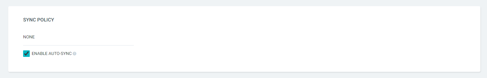

- Одразу помітимо що ArgoCD виявив зміни в конфігурації та застосував їх до 
нашого застосунку
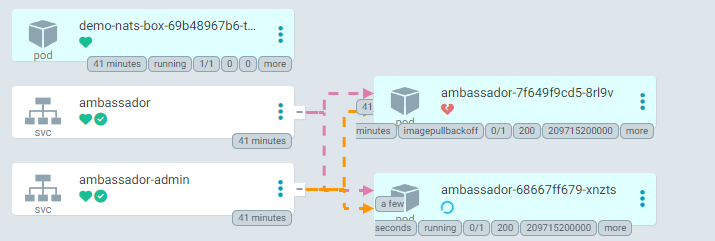

- І менше ніж за хвилину сервіс  `ambassador` вже усі компоненти додатку "зелені"
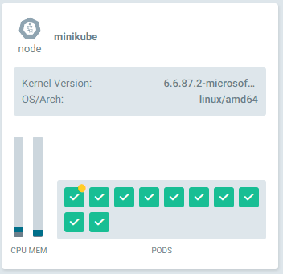


6. Перевіряємо роботу застосунку AsciiArtify
- Переадресуємо порти наступною командою:
```bash
$ k port-forward -n demo svc/ambassador 8088:80
Forwarding from 127.0.0.1:8088 -> 80
Forwarding from [::1]:8088 -> 80
```
- Зробимо запит на вказаний порт та отримаємо відповідь у вигляді версії додатку:  
```bash
$ curl localhost:8088
k8sdiy-api:599e1af#       
```

7. Перевіримо роботу бізнес-функціоналу додатку
- Для цього завантажимо файл що зберігається у нас в локальному сховищі на віддалений сервер командою:
```bash
curl -F 'image=@./logo.png' localhost:8088/img/
```
- Отримаємо результат прямо в консолі:  

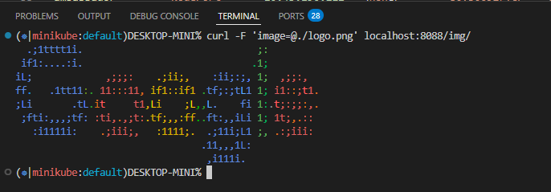  

